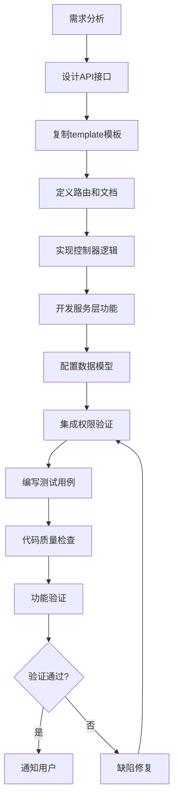
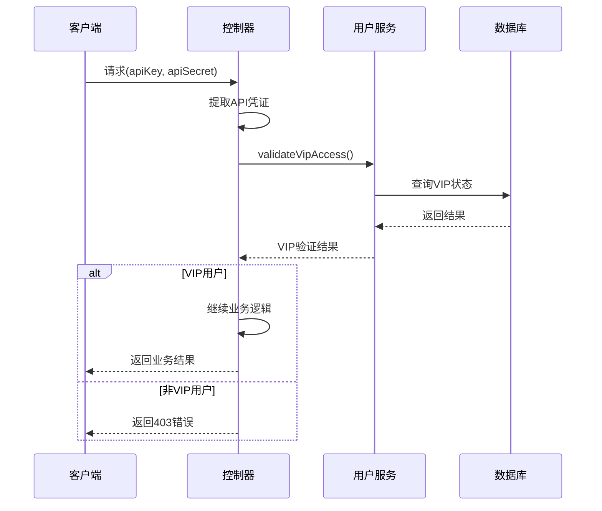

# REST API 开发指南

## 概述

在 ppll-server 项目中，`template` 模块是一个约束开发者的标准化API接口模板。这个模块的命名叫 "template"，所以它实际上是一个完整的 API 模块，以"订单管理"作为举例，提供订单的创建、查询、更新和删除等核心功能。

## 为什么叫 "template"？

通过分析代码结构，`template` 模块实际上是作为一个标准化的订单操作模板而设计的：

1. 标准化接口设计：完整的 CRUD 操作接口
2. VIP权限验证模板
3. 错误处理模板：统一的错误处理和响应格式
4. 文档规范模板：详细的 Swagger API 文档注释
5. 业务逻辑分层模板：Controller -> Service -> Model 的标准分层架构

## 标准化开发流程

### 完整开发流程



### 标准模块结构

```
新API模块标准结构：
├── route/v1/{module}.route.js         # 路由定义和API文档，使用Express Router，完整Swagger注释
├── controller/{module}.controller.js  # 控制器逻辑实现，请求处理、权限验证、响应格式化
├── service/{module}.service.js        # 业务服务层逻辑，核心业务逻辑、数据处理，返回处理结果
├── models/{entity}.js                 # 数据模型定义，使用Sequelize ORM，定义关联关系
└── validations/{module}.validation.js # 参数验证规则（可选,谨慎生成,谨慎使用）
```

### 快速开始步骤

1. 复制模板文件

    ```bash
    # 创建新模块目录结构
    cp route/v1/template.route.js route/v1/{your-module}.route.js
    cp controller/template.controller.js controller/{your-module}.controller.js
    cp service/template.service.js service/{your-module}.service.js
    ```

2. 更新模块引用
    - 修改文件中的导入路径
    - 更新API端点路径
    - 调整Swagger标签和描述

3. 注册路由
   在 route/route.manager.js 中注册新路由

### 开发约束条件

#### 必须遵循的开发顺序

1. 第一步：数据模型设计 - 必须先完成数据模型定义
2. 第二步：服务层实现 - 实现核心业务逻辑
3. 第三步：控制器层开发 - 处理HTTP请求和响应
4. 第四步：路由层配置 - 定义API端点和文档
5. 第五步：权限验证集成 - 配置相应的权限验证
6. 第六步：测试用例编写 - 编写完整的单元测试
7. 第七步：功能验证 - 端到端功能测试

#### 代码注释规范

- 所有注释必须使用中文
- 函数注释格式：
    ```javascript
    /**
     * 创建订单
     * @param {Object} orderData - 订单数据
     * @param {string} orderData.symbol - 交易对符号
     * @param {string} orderData.side - 买卖方向
     * @returns {Object} 创建的订单信息
     */
    const createOrder = async (orderData) => {
        // 验证订单参数
        if (!orderData.symbol) {
            throw new Error("交易对符号不能为空");
        }

        // 执行订单创建逻辑
        const result = await OrderModel.create(orderData);
        return result;
    };
    ```

#### 强制性架构约束

- 控制器层禁止直接操作数据库
- 服务层禁止处理HTTP响应
- 路由层禁止包含业务逻辑
- 模型层禁止包含业务验证逻辑

#### 权限验证约束

- VIP功能必须验证API密钥
- 管理员功能必须验证角色权限
- 公开接口也需要基础的安全验证

## API设计标准

#### 文件命名规范

- 路由文件：`{module-name}.route.js` (使用短横线分隔)
- 控制器文件：`{module-name}.controller.js`
- 服务文件：`{module-name}.service.js`
- 模型文件：`{entity-name}.js` (单数形式)

#### 函数命名规范

- 控制器函数：`create{Resource}`, `query{Resources}`, `update{Resource}`, `delete{Resource}`
- 服务函数：`create{Resource}`, `getAll{Resources}`, `get{Resource}ById`, `update{Resource}ById`, `delete{Resource}ById`
- 所有函数名必须使用驼峰命名法

#### 变量命名规范

```javascript
// 正确示例
const orderData = req.body; // 驼峰命名
const MAX_RETRY_COUNT = 3; // 常量大写+下划线
const isVipUser = true; // 布尔值使用 is/has 前缀

// 错误示例
const order_data = req.body; // ✗ 不允许使用下划线
const maxretrycount = 3; // ✗ 常量必须大写
const vip = true; // ✗ 不明确的布尔值名称
```

### 路由路径规范

#### 必须遵循的路径模式

```javascript
// 标准路径格式
/v1/{resource-name}/{action}

// 具体示例
/v1/order/create          // 创建订单
/v1/order/delete          // 删除订单
/v1/order/update          // 更新订单
/v1/order/query           // 查询订单
```

#### 禁止的路径模式

```javascript
// ✗ 禁止使用的格式
/api/v1/template              // 不允许额外的 /api 前缀
/v1/templates                 // 不允许复数形式的资源名
/v1/template/:id              // 不允许增加理解难度的路径参数
/v1/createTemplate            // 不允许动词+名词的路径
```

### 标准请求/响应格式

#### 成功响应格式

```json
{
    "status": "success",
    "code": 200,
    "data": {
        // 实际数据内容
    }
}
```

#### 异常响应格式

```json
{
    "status": "error",
    "code": 400,
    "message": "错误描述信息"
}
```

#### 分页响应格式

```json
{
    "status": "success",
    "code": 200,
    "data": {
        "list": [], // 数据列表（统一使用 list 字段）
        "currentPage": 1, // 当前页码（默认为1）
        "pageSize": 10, // 每页数量（默认为10，最大100）
        "total": 100 // 总页数
    }
}
```

### Swagger文档约束

#### 必须包含的元素

- tags：接口分组标签
- summary：简短的功能描述（中文）
- description：详细的功能说明（中文）
- requestBody：请求参数定义
- responses：所有可能的响应状态码
- examples：真实有效的请求/响应示例

#### 标准Swagger注释模板

```javascript
/**
 * @openapi
 * /v1/{module}/{action}:
 *   post:
 *     tags: [模块名称]  # 中文标签
 *     summary: 功能简述     # 中文描述
 *     description: |
 *       详细的功能说明，包括：
 *       - 使用场景和限制条件
 *       - 注意事项和风险提示
 *       - 相关业务规则说明
 *     requestBody:
 *       required: true
 *       content:
 *         application/json:
 *           schema:
 *             type: object
 *             required: [param1, param2]
 *             properties:
 *               param1:
 *                 type: string
 *                 description: 参数说明  # 中文说明
 *           examples:
 *             basic:
 *               summary: 基础用法
 *               value: { param1: "示例值" }
 *     responses:
 *       200:
 *         description: 操作成功
 *       400:
 *         description: 参数错误
 *       403:
 *         description: 权限不足
 */
```

## 权限验证机制

### VIP权限验证流程



### 权限验证实现模板

在router中使用vip权限校验中间件：

```javascript
const vipMiddleware = require("../../middleware/vip.js");

/**
 * 创建用户
 * /v1/user/create:
 */
router.post("/create", vipMiddleware.validateVipAccess, controller.create);
```

### 日志记录约束

#### 日志格式约束

```javascript
// ✓ 正确的日志格式
console.error("创建订单失败:", {
    userId: req.user?.id,
    orderData: req.body,
    error: error.message,
    timestamp: new Date().toISOString(),
});

// ✗ 错误的日志格式
console.log("error creating order:", error); // 不允许英文日志
console.error(error); // 不能缺少上下文信息
```

## 数据模型设计

### Sequelize 模型定义模板

```javascript
"use strict";
const { Model } = require("sequelize");

module.exports = (sequelize, DataTypes) => {
    class YourModel extends Model {
        static associate(models) {
            // 定义关联关系
            YourModel.belongsTo(models.User, {
                foreignKey: "user_id",
                as: "user",
            });
        }
    }

    YourModel.init(
        {
            // 主键字段
            id: {
                type: DataTypes.BIGINT,
                primaryKey: true,
                autoIncrement: true,
                comment: "主键ID",
            },

            // 业务字段
            name: {
                type: DataTypes.STRING(255),
                allowNull: false,
                comment: "名称",
            },

            // 时间戳字段
            createdAt: {
                type: DataTypes.DATE,
                field: "created_at",
                allowNull: false,
                defaultValue: DataTypes.NOW,
                comment: "创建时间",
            },

            updatedAt: {
                type: DataTypes.DATE,
                field: "updated_at",
                allowNull: false,
                defaultValue: DataTypes.NOW,
                comment: "更新时间",
            },
        },
        {
            sequelize,
            modelName: "your_table",
            tableName: "your_table",
        },
    );

    return YourModel;
};
```

## 代码质量标准

### 开发检查清单

#### 代码实现检查

- [ ] 分层架构：严格按照 Route → Controller → Service → Model 分层
- [ ] 权限验证：正确实现VIP或其他权限验证机制
- [ ] 错误处理：使用统一的错误处理格式和状态码
- [ ] 参数验证：实现完整的请求参数验证
- [ ] 响应格式：使用标准化的响应格式

#### API 文档检查

- [ ] Swagger 注释：编写完整的 API 文档注释
- [ ] 示例数据：提供真实有效的请求/响应示例

### 单元测试约束

#### 必须编写的测试用例

- 正常流程测试：所有正常业务场景
- 异常流程测试：参数错误、权限不足等场景
- 边界值测试：最大值、最小值、空值等情况
- 并发测试：高并发访问情况

#### 测试用例结构约束

```javascript
// ✓ 正确的测试结构 - 可以直接通过node运行的js代码
// test.js
import axios from "axios";
const post = (d) => axios.post("http://localhost:3000/v1/order/create", d);

(async () => {
    try {
        await post({ userId: 1, items: ["A1001"] }).then(
            (r) => r.status === 201 || Promise.reject("201 fail"),
        );

        await post({}).catch(
            (e) => e.response.status === 400 || Promise.reject("400 fail"),
        );

        await post({ userId: 2, items: ["A1001"] }).catch(
            (e) => e.response.status === 403 || Promise.reject("403 fail"),
        );
    } catch (_) {
        console.error("❌ fail");
        process.exit(1);
    }
})();

// ✗ 错误的测试结构-不允许使用测试框架
describe("Order Management", () => {
    // 英文描述
    test("should create order", () => {
        // 英文描述
        // 测试实现
    });
});
```

### 性能优化约束

- 分页查询：所有列表查询必须支持分页, 禁止无限制查询.
- 重要提醒：本指南基于 template 模块的最佳实践制定，所有新的 API 开发都应严格遵循这些标准，以确保项目的长期可维护性和团队协作效率。
- 特别强调：所有注释和错误信息必须使用中文，这是项目的强制性要求，不可商量！

## Template 模块更新说明

### 查询接口优化

template 模块的查询接口已优化，支持更灵活的查询方式：

#### 新增查询参数

- `id`: 查询单个订单ID（可选）
- `ids`: 查询多个订单ID，逗号分隔（可选，例如：`ids=1,2,3`）
- `user_id`: 按用户ID过滤（可选）
- `currentPage`: 页码（可选，默认为1）
- `pageSize`: 每页数量（可选，默认为10）

#### 查询优先级

1. 如果提供 `id` 参数，返回单个订单的详细信息
2. 如果提供 `ids` 参数，返回多个订单的列表
3. 如果都不提供，返回分页的所有订单列表

#### 统一返回格式

所有查询都使用统一的 `list` 字段返回数据：

```json
{
    "status": "success",
    "data": {
        "list": [
            {
                "id": 1001,
                "order_id": "28141",
                "symbol": "BTCUSDT",
                "side": "BUY",
                "type": "LIMIT"
                // ... 其他订单字段
            }
        ],
        "total": 1,
        "currentPage": 1,
        "pageSize": 10
    }
}
```

## 总结

要求将 template 模块作为新功能开发的起点和参考标准，确保整个项目的代码质量和架构一致性。
